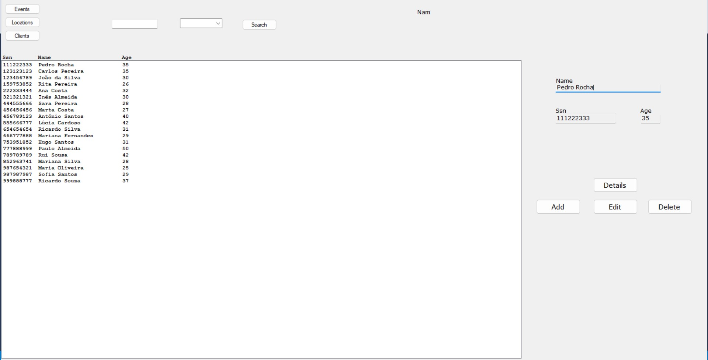

# BD: Trabalho Prático APF-T

**Grupo**: P5G9
- Rafael Vilaça MEC: 107476
- Diogo Silva, MEC: 107647

## Introdução / Introduction
 
Este projeto é sobre uma base de dados para gestão de eventos.
A mesma contem diversas funçoes para tornar a sua utilizaçao ser mais simples e user friendly.

## ​Análise de Requisitos / Requirements

## DER - Diagrama Entidade Relacionamento/Entity Relationship Diagram

### Versão final/Final version


### APFE 

Alterações feitas em relação á primeira entrega:
    . Atributo nfunc passou a ser um atributo derivado
    . Eliminado atributo n_ads_displayed em ad
    . Location passou a ser uma entidade com atributos location_id e atributo composto address(street e city)
    . Atributo postal_code retirado de location
    . Criamos a entidade client com atributos name,Ssn(chave primária) e age que vai estar relacionada a sales, com cardinalidade N:1(Sales:Client)
    . Criamos uma entidade activity que vai ter uma especialização IS-A disjoint da qual resultam workshop(com atributo theme) e performer(com atributo n_elements) e, a chave primária destas 2 entidades será activity_id
    .As relações event-supplier,event-sponsor e event-organizer passaram a ser 1:N


## ER - Esquema Relacional/Relational Schema

### Versão final/Final Version


### APFE

Alterações feitas em relação á primeira entrega:
    . Retirado atributo n_ads_displayed de ad
    . Devido a adição da entidade client(com atributos name,age,Ssn(chave primária)) foi adicionado um atributo Ssn à entidade sales que vai ser chave primária e chave estrangeira
    . Nas entidades Sponsor,Organizer e Supplier o atributo event_id passou a ser chave primária
    . Location passou a ser uma  entidade(com atributos street,city,location_id(chave primária)) e location_id vai ser chave primária e chave estrangeira de event
    . Como no diagrama DER foi criada a especialização IS-A disjoint para activity->(workshop e schedule), então foram criadas as entidades activity,workshop e performer onde activity_id vai ser chave primaria de activity e chave primária e chave estrangeira de workshop e performer

## ​SQL DDL - Data Definition Language

[SQL DDL File](sql/01_ddl.sql "SQLFileQuestion")

## SQL DML - Data Manipulation Language

Uma secção por formulário.
A section for each form.

### Form1


```sql
-- Show data on the form
SELECT E.Event_ID,EventName,N_tickets_vip,N_tickets_public,Price_vip,Price_public,EventLocation_ID,L_Name,O.Name AS organizer_name,S.Name AS supplier_name,SP.Name AS sponsor_name FROM Event LEFT JOIN Location L ON E.EventLocation_ID = L.Location_ID LEFT JOIN Organizer ORG ON E.Event_ID = ORG.Event_ID LEFT JOIN Company O ON ORG.O_ID = O.ID LEFT JOIN Supplier SUP ON E.Event_ID = SUP.Event_ID LEFT JOIN Company S ON SUP.S_ID = S.ID LEFT JOIN Sponsor SPONS ON E.Event_ID = SPONS.Event_ID LEFT JOIN Company SP ON SPONS.SP_ID = SP.ID;

-- Insert new event
INSERT Event VALUES (@EventID, @EventName, @NTV, @NTP, @PV, @PP, @L_ID);

--Udate existing event
Drop proc if exists dbo.UpdateEvent ;
GO

CREATE PROC dbo.UpdateEvent (
    @EventID INT,
    @EventName VARCHAR(30),
    @N_tickets_vip INT,
    @N_tickets_public INT,
    @Price_vip INT,
    @Price_public INT,
	@Location_ID Int
)
AS
BEGIN
    UPDATE Event
    SET EventName = @EventName,
        N_tickets_vip = @N_tickets_vip,
        N_tickets_public = @N_tickets_public,
        Price_vip = @Price_vip,
		EventLocation_ID = @Location_ID,
        Price_public = @Price_public
    FROM Event
    INNER JOIN Location ON Event.EventLocation_ID = Location.Location_ID
    WHERE Event_ID = @EventID;

END;
GO

--Search Event
SELECT E.Event_ID, EventName, N_tickets_vip, N_tickets_public, Price_vip, Price_public, EventLocation_ID, L_Name,O.Name AS organizer_name, S.Name AS supplier_name, SP.Name AS sponsor_name FROM Event E LEFT JOIN Location L ON E.EventLocation_ID = L.Location_ID LEFT JOIN Organizer ORG ON E.Event_ID = ORG.Event_ID LEFT JOIN Company O ON ORG.O_ID = O.ID LEFT JOIN Supplier SUP ON E.Event_ID = SUP.Event_ID LEFT JOIN Company S ON SUP.S_ID = S.ID LEFT JOIN Sponsor SPONS ON E.Event_ID = SPONS.Event_ID LEFT JOIN Company SP ON SPONS.SP_ID = SP.ID;

--Delete Event
DROP PROC dbo.DeleteEvent
GO

CREATE PROCEDURE DeleteEvent @EventID INT
AS
BEGIN
	DELETE FROM Ad WHERE Event_ID= @EventID;
    DELETE FROM Sales WHERE Event_ID = @EventID;
    DELETE FROM Sponsor WHERE Event_ID = @EventID;
    DELETE FROM Organizer WHERE Event_ID = @EventID;
    DELETE FROM Supplier WHERE Event_ID = @EventID;
    DELETE FROM Schedule WHERE Event_ID = @EventID;
    DELETE FROM Activity WHERE Activity_ID IN (SELECT Activity_ID FROM Schedule WHERE Event_ID = @EventID);
    DELETE FROM Event WHERE Event_ID = @EventID;
END;
GO

Exec dbo.DeleteEvent @EventID

```
### Form2


```sql
--Show data on form
    --Sale
SELECT Sale_ID,Event_ID,N_tickets,Ssn,T_type " + "FROM Sales Where Event_ID = @ID ;

    --Schedule
SELECT S.Schedule_ID AS S_ID,S.Event_ID as E_ID, A.Activity_ID AS act_ID, A.Name AS Activity_name, S.Day, S.Hour, A.Objective, A.Cost FROM Schedule AS S JOIN Activity AS A ON S.Activity_Id = A.Activity_ID Where S.Event_ID = @ID;

    --Ad
Select * FROM AD join Event on Event.Event_ID = AD.Event_ID Where Event.Event_ID = @ID;

--Update Sales
Drop proc if exists dbo.UpdateSales ;
GO

CREATE PROCEDURE dbo.UpdateSales
    @Sale_ID INT,
    @Event_ID INT,
    @N_tickets INT,
    @Ssn INT,
    @T_type VARCHAR(15)
	AS
	BEGIN
		IF EXISTS (SELECT 1 FROM Sales WHERE Sale_ID = @Sale_ID)
		BEGIN
			UPDATE Sales
			SET 
				N_tickets = @N_tickets,
				Ssn = @Ssn,
				T_type = @T_type
			WHERE Sale_ID = @Sale_ID and Event_ID = @Event_ID;
		END
		ELSE
		BEGIN
			RAISERROR ('The specified sale ID does not exist.', 16, 1);
			RETURN;
		END
	END;
go

EXEC UpdateSales @SaleID,@EventId,@N_tickets,@Ssn,@T_type;

--Update Schedule
Drop proc if exists dbo.UpdateSchedule ;
GO

CREATE PROC dbo.UpdateSchedule(
    @Event_ID INT,
    @Day INT,
    @Activity_ID INT,
    @Hour INT,
    @Schedule_ID INT
)
AS
BEGIN
    UPDATE Schedule
    SET Day = @Day,
        Activity_ID = @Activity_ID,
        Hour = @Hour
        FROM Schedule
        WHERE Event_ID = @Event_ID AND Schedule_ID = @Schedule_ID
END;
GO

EXEC UpdateSchedule @EventId,@Day,@A_id,@Hour,@ScheduleID;

--Update Ad
Drop proc if exists dbo.UpdateAd ;
GO

CREATE PROC dbo.UpdateAd (
	@Duration INT,
	@Ad_ID INT,
	@Cost MONEY,
	@Event_ID INT
)
AS
BEGIN
    UPDATE Ad
    SET Duration = @Duration,
        Cost = @Cost
    FROM Ad
	WHERE Ad_ID = @Ad_ID AND Event_ID = @Event_ID
END;
GO

EXEC UpdateAd @Duration,@Ad_Id,@Cost,@Event_ID

--Delete Sales
DROP PROC dbo.DeleteSale
GO

CREATE PROCEDURE DeleteSale 
	@Sale_ID INT,
	@E_ID INT
AS
BEGIN
	DELETE FROM Sales WHERE Sale_ID=@Sale_ID and Event_ID=@E_ID;
END;
GO

Exec dbo.DeleteSale @SaleID,@Event_ID

--Delete Ad
DROP PROC if exists dbo.DeleteAd
GO

CREATE PROCEDURE dbo.DeleteAd 
	@Ad_ID INT,
	@Event_ID INT
AS
BEGIN
	DELETE FROM Ad WHERE Ad_ID=@Ad_ID and Event_ID=@Event_ID;
END;
GO

Exec dbo.DeleteAd @AdID,@E_ID

--Delete Schedule
DROP PROC dbo.DeleteSchedule
GO

CREATE PROCEDURE DeleteSchedule 
	@Schedule_ID INT,
	@E_ID INT
AS
BEGIN
	DELETE FROM Schedule WHERE Schedule_ID=@Schedule_ID and Event_ID=@E_ID;
END;
GO

Exec dbo.DeleteSchedule @SCHID,@E_ID

--Add sales
INSERT INTO Sales (Sale_ID, Event_ID, N_tickets, Ssn, T_type) VALUES (@SaleID, @EventID, @NTickets, @Ssn, @TType);

--Add Schedule
INSERT INTO Schedule (Event_ID,Day,Activity_Id,Hour,Schedule_ID) VALUES (@SaleID, @EventID, @NTickets, @Ssn, @TType);

--Add Ad
INSERT INTO Ad (Event_ID,Duration,Ad_ID,Cost) VALUES (@EventID,@Duration,@AdID,@Cost);

```

### Form3


```sql
--Show data on form
    --Sale
SELECT Sale_ID,Event_ID,N_tickets,Ssn,T_type " + "FROM Sales Where Event_ID = @ID ;

    --Schedule
SELECT S.Schedule_ID AS S_ID,S.Event_ID as E_ID, A.Activity_ID AS act_ID, A.Name AS Activity_name, S.Day, S.Hour, A.Objective, A.Cost FROM Schedule AS S JOIN Activity AS A ON S.Activity_Id = A.Activity_ID Where S.Event_ID = @ID;

    --Ad
Select * FROM AD join Event on Event.Event_ID = AD.Event_ID Where Event.Event_ID = @ID;

--Update Sales
Drop proc if exists dbo.UpdateSales ;
GO

CREATE PROCEDURE dbo.UpdateSales
    @Sale_ID INT,
    @Event_ID INT,
    @N_tickets INT,
    @Ssn INT,
    @T_type VARCHAR(15)
	AS
	BEGIN
		IF EXISTS (SELECT 1 FROM Sales WHERE Sale_ID = @Sale_ID)
		BEGIN
			UPDATE Sales
			SET 
				N_tickets = @N_tickets,
				Ssn = @Ssn,
				T_type = @T_type
			WHERE Sale_ID = @Sale_ID and Event_ID = @Event_ID;
		END
		ELSE
		BEGIN
			RAISERROR ('The specified sale ID does not exist.', 16, 1);
			RETURN;
		END
	END;
go

EXEC UpdateSales @SaleID,@EventId,@N_tickets,@Ssn,@T_type;

--Update Schedule
Drop proc if exists dbo.UpdateSchedule ;
GO

CREATE PROC dbo.UpdateSchedule(
    @Event_ID INT,
    @Day INT,
    @Activity_ID INT,
    @Hour INT,
    @Schedule_ID INT
)
AS
BEGIN
    UPDATE Schedule
    SET Day = @Day,
        Activity_ID = @Activity_ID,
        Hour = @Hour
        FROM Schedule
        WHERE Event_ID = @Event_ID AND Schedule_ID = @Schedule_ID
END;
GO

EXEC UpdateSchedule @EventId,@Day,@A_id,@Hour,@ScheduleID;

--Update Ad
Drop proc if exists dbo.UpdateAd ;
GO

CREATE PROC dbo.UpdateAd (
	@Duration INT,
	@Ad_ID INT,
	@Cost MONEY,
	@Event_ID INT
)
AS
BEGIN
    UPDATE Ad
    SET Duration = @Duration,
        Cost = @Cost
    FROM Ad
	WHERE Ad_ID = @Ad_ID AND Event_ID = @Event_ID
END;
GO

EXEC UpdateAd @Duration,@Ad_Id,@Cost,@Event_ID

--Delete Sales
DROP PROC dbo.DeleteSale
GO

CREATE PROCEDURE DeleteSale 
	@Sale_ID INT,
	@E_ID INT
AS
BEGIN
	DELETE FROM Sales WHERE Sale_ID=@Sale_ID and Event_ID=@E_ID;
END;
GO

Exec dbo.DeleteSale @SaleID,@Event_ID

--Delete Ad
DROP PROC if exists dbo.DeleteAd
GO

CREATE PROCEDURE dbo.DeleteAd 
	@Ad_ID INT,
	@Event_ID INT
AS
BEGIN
	DELETE FROM Ad WHERE Ad_ID=@Ad_ID and Event_ID=@Event_ID;
END;
GO

Exec dbo.DeleteAd @AdID,@E_ID

--Delete Schedule
DROP PROC dbo.DeleteSchedule
GO

CREATE PROCEDURE DeleteSchedule 
	@Schedule_ID INT,
	@E_ID INT
AS
BEGIN
	DELETE FROM Schedule WHERE Schedule_ID=@Schedule_ID and Event_ID=@E_ID;
END;
GO

Exec dbo.DeleteSchedule @SCHID,@E_ID

--Add sales
INSERT INTO Sales (Sale_ID, Event_ID, N_tickets, Ssn, T_type) VALUES (@SaleID, @EventID, @NTickets, @Ssn, @TType);

--Add Schedule
INSERT INTO Schedule (Event_ID,Day,Activity_Id,Hour,Schedule_ID) VALUES (@SaleID, @EventID, @NTickets, @Ssn, @TType);

--Add Ad
INSERT INTO Ad (Event_ID,Duration,Ad_ID,Cost) VALUES (@EventID,@Duration,@AdID,@Cost);

```
### Form4


```sql
--Show data on Form
SELECT *  FROM Client

--Search client
SELECT Ssn,C_Name,Age FROM Client 

--Add client
INSERT INTO Client (Ssn,C_Name,Age) VALUES (@Ssn, @C_Name, @Age)

--Update Client
Drop proc if exists dbo.UpdateClients ;
GO

CREATE PROC dbo.UpdateClients(
	@Ssn INT,
	@C_Name VARCHAR(30),
	@Age INT
)
AS
BEGIN
    BEGIN
		UPDATE Client
		SET C_Name = @C_Name,
			Age = @Age
		WHERE Ssn = @Ssn
	END
END;
GO

EXEC UpdateClient @Ssn,@C_Name,@Age

--Delete Client
DROP PROC if exists dbo.DeleteClient
GO

CREATE PROCEDURE DeleteClient @Ssn INT
AS
BEGIN
	DELETE FROM Sales WHERE Ssn IN (SELECT Ssn FROM dbo.Client WHERE Ssn = @Ssn)
	DELETE FROM Client WHERE Ssn = @Ssn
END;
GO

Exec dbo.DeleteClient @Ssn

```
### Form5


```sql
--Show data on Form
SELECT Sale_ID,Event.Event_ID,EventName,N_tickets,Ssn,T_type " + "FROM Sales Join EVENT on EVENT.Event_ID = Sales.Event_ID Where SSN = @ID;

--Add Sale
INSERT INTO Sales VALUES (@SaleID, @EventID, @NTickets, @Ssn, @TType);

--Update Sale
Drop proc if exists dbo.UpdateSalesC;
GO

CREATE PROCEDURE dbo.UpdateSalesC
    @Sale_ID INT,
    @Event_ID INT,
    @N_tickets INT,
    @T_type VARCHAR(15),
	@Ssn INT
    AS
    BEGIN
        IF EXISTS (SELECT 1 FROM Sales WHERE Sale_ID = @Sale_ID)
        BEGIN
            UPDATE Sales
            SET 
                N_tickets = @N_tickets,
                T_type = @T_type,
				Event_ID = @Event_ID
            WHERE Sale_ID = @Sale_ID AND Ssn = @Ssn;
        END
        ELSE
        BEGIN
            RAISERROR ('The specified sale ID does not exist.', 16, 1);
            RETURN;
        END
    END;
GO

EXEC UpdateSalesC @SaleID,@EventID,@NTickets,@TType,@Ssn;

--Delete Sale
DROP PROC dbo.DeleteSale
GO

CREATE PROCEDURE DeleteSale 
	@Sale_ID INT,
	@E_ID INT
AS
BEGIN
	DELETE FROM Sales WHERE Sale_ID=@Sale_ID and Event_ID=@E_ID;
END;
GO

Exec dbo.DeleteSale @Sale_ID,@Event_ID

```
### Form6


```sql
--Show data on Form
SELECT * FROM Location;

--Search location
SELECT Location_ID,L_Name,L_Address,L_City FROM Location;

--Update location
Drop proc if exists dbo.UpdateLocation ;
GO

CREATE PROC dbo.UpdateLocation (
	@Location_ID INT,
	@L_Name VARCHAR(30),
	@L_Address VARCHAR(30),
	@L_City VARCHAR(30)
)
AS
BEGIN
    UPDATE Location
    SET 
        L_Name = @L_Name,
        L_Address = @L_Address,
        L_City = @L_City
    FROM Location
	Where Location_ID = @Location_ID
END;
GO

EXEC UpdateLocation @Location_ID,@L_Name,@L_Address,@L_City;

--Add location
INSERT INTO Location VALUES (@L_ID, @L_Name, @L_Addr, @L_City);

--Delete location
DROP PROC if exists dbo.EliminateLocal
GO

CREATE PROCEDURE dbo.EliminateLocal @LocationID INT
AS
	DELETE FROM dbo.Sponsor WHERE Event_ID IN (SELECT Event_ID FROM dbo.Event WHERE EventLocation_ID = @LocationID)
	DELETE FROM dbo.Organizer WHERE Event_ID IN (SELECT Event_ID FROM dbo.Event WHERE EventLocation_ID = @LocationID)
	DELETE FROM dbo.Supplier WHERE Event_ID IN (SELECT Event_ID FROM dbo.Event WHERE EventLocation_ID = @LocationID)
	DELETE FROM dbo.Schedule WHERE Event_ID IN (SELECT Event_ID FROM dbo.Event WHERE EventLocation_ID = @LocationID)
	DELETE FROM dbo.Ad WHERE Event_ID IN (SELECT Event_ID FROM dbo.Event WHERE EventLocation_ID = @LocationID)
	DELETE FROM dbo.Sales WHERE Event_ID IN (SELECT Event_ID FROM dbo.Event WHERE EventLocation_ID = @LocationID)
	DELETE FROM dbo.Event WHERE  EventLocation_ID = @LocationID
	DELETE FROM dbo.Location WHERE Location_ID = @LocationID
GO

Exec EliminateLocal @L_ID

```
### Form7


```sql

--Show data on Form
SELECT E.Event_ID,EventName,N_tickets_vip,N_tickets_public,Price_vip,Price_public,EventLocation_ID,L_Name,O.Name AS organizer_name,S.Name AS supplier_name,SP.Name AS sponsor_name FROM Event E LEFT JOIN Location L ON E.EventLocation_ID = L.Location_ID LEFT JOIN Organizer ORG ON E.Event_ID = ORG.Event_ID LEFT JOIN Company O ON ORG.O_ID = O.ID LEFT JOIN Supplier SUP ON E.Event_ID = SUP.Event_ID LEFT JOIN Company S ON SUP.S_ID = S.ID LEFT JOIN Sponsor SPONS ON E.Event_ID = SPONS.Event_ID LEFT JOIN Company SP ON SPONS.SP_ID = SP.ID Where E.EventLocation_ID = @ID;

--Add event
INSERT Event (Event_ID, EventName, N_tickets_vip, N_tickets_public,EventLocation_ID,Price_vip,Price_public) VAlUES (@EventID,@EventName,@N_tickets_public,@N_tickets_public,@Location_ID,@Price_vip,@Price_public);

--Update Event
DROP PROC IF EXISTS dbo.UpdateEventL;
GO

CREATE PROC dbo.UpdateEventL (
    @EventID INT,
    @EventName VARCHAR(30),
    @N_tickets_vip INT,
    @N_tickets_public INT,
    @Location_ID Int
)
AS
BEGIN
    UPDATE Event
    SET EventName = @EventName,
        N_tickets_vip = @N_tickets_vip,
        N_tickets_public = @N_tickets_public,
        EventLocation_ID = @Location_ID
    WHERE Event_ID = @EventID;

END;
GO

EXEC UpdateEventL @EventID,@EventName,@NTV,@NTP,@Location_ID;

--Delete event
DROP PROC dbo.DeleteEvent
GO

CREATE PROCEDURE DeleteEvent @EventID INT
AS
BEGIN
	DELETE FROM Ad WHERE Event_ID= @EventID;
    DELETE FROM Sales WHERE Event_ID = @EventID;
    DELETE FROM Sponsor WHERE Event_ID = @EventID;
    DELETE FROM Organizer WHERE Event_ID = @EventID;
    DELETE FROM Supplier WHERE Event_ID = @EventID;
    DELETE FROM Schedule WHERE Event_ID = @EventID;
    DELETE FROM Activity WHERE Activity_ID IN (SELECT Activity_ID FROM Schedule WHERE Event_ID = @EventID);
    DELETE FROM Event WHERE Event_ID = @EventID;
END;
GO

Exec dbo.DeleteEvent @EventID

```

...

## Normalização/Normalization

Depois de uma análise de todas as tabelas chegamos á conclusão que:
     Todas as colunas de todas as tabelas têm um único valor(1FN);
     Não existem dependências paricais(2FN);
     Não exitedm dependências transitivas(3FN) 
Então chegamos á conclusão que a nossa Base de Dados encontra-se na 3FN. 


## Índices/Indexes

```sql

--Util ao pesquisar por um nome de uma localização em especifico isto é usado no trigger e na pesquisa nos forms--
DROP INDEX IF EXISTS IX_Location_LName ON Location;

CREATE INDEX IX_Location_LName ON Location (L_Name);

--Util para qualquer query q use locations e eventos ao mesmo tempo
DROP INDEX IF EXISTS IX_Event_EventLocationID ON Event;

CREATE INDEX IX_Event_EventLocationID ON Event (EventLocation_ID);

--Util para qualquer query que use schdules com atividades para um evento em especifico--
DROP INDEX IF EXISTS IX_Schedule_EventID_ActivityID ON Schedule;

CREATE INDEX IX_Schedule_EventID_ActivityID ON Schedule (Event_ID, Activity_ID);

```

## SQL Programming: Stored Procedures, Triggers, UDF

[SQL SPs and Functions File](sql/02_sp_functions.sql "SQLFileQuestion")

[SQL Triggers File](sql/03_triggers.sql "SQLFileQuestion")

## Outras notas/Other notes

### Dados iniciais da dabase de dados/Database init data

[Indexes File](sql/01_ddl.sql "SQLFileQuestion")


 